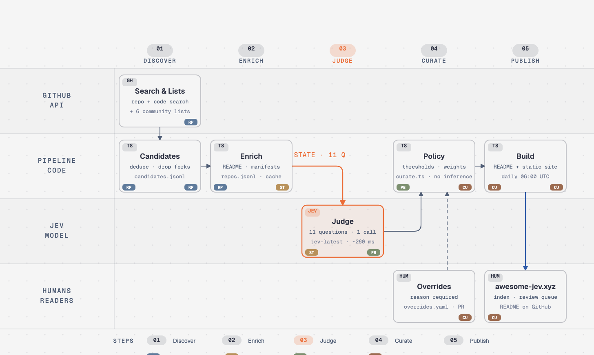

# Awesome Jev 

   

> Projects built on [Jev](https://typesafe.ai), TypeSafe AI's System One model. Curated by Jev itself.

Every repository here was collected from GitHub, then judged by Jev in a single call: is it genuinely about Jev, which category, which decision pattern, and how substantial, documented, and novel it is. Code applies the policy; nothing below was hand-picked. The full index with probabilities lives on the site, along with the [review queue](https://awesome-jev.xyz/review) of borderline cases.

This is an independent community project, not affiliated with TypeSafe AI. Jev and System One are TypeSafe AI product names.

## Contents

- [Official](#official)
- [SDKs and Clients](#sdks-and-clients)
- [Integrations](#integrations)
- [Agent and Developer Tooling](#agent-and-developer-tooling)
- [Applications](#applications)
- [Games, Robotics, and Simulation](#games-robotics-and-simulation)
- [Research, Evals, and Reimplementations](#research-evals-and-reimplementations)
- [Learning](#learning)
- [Other Lists](#other-lists)
- [Other](#other)
- [How This List Is Made](#how-this-list-is-made)

## Official

Maintained by TypeSafe AI.

- [system-one-adapter-python](https://github.com/typesafe-ai/system-one-adapter-python) - Drop-in TypeSafeClient replacement backed by LLM APIs.
- [typesafe-sdk-js](https://github.com/typesafe-ai/typesafe-sdk-js) - The official TypeScript/JavaScript library for the TypeSafe API.
- [typesafe-sdk-python](https://github.com/typesafe-ai/typesafe-sdk-python) - The official Python library for the TypeSafe API.
- [skills](https://github.com/typesafe-ai/skills) - Agent skills for building with TypeSafe's System One API.

## SDKs and Clients

Language bindings, CLIs, and thin wrappers for the API.

- [jevi](https://github.com/bitomule/jevi) - Ask typed questions about a text and branch on the answer. A shell front end for TypeSafe's Jev.
- [jev-ultralightspeed](https://github.com/collapseindex/jev-ultralightspeed) - BRRRRRRRRRRRRRRRRRRRRRR.
- [daf-jev](https://github.com/docxology/daf-jev) - Composable Python toolkit for TypeSafe's Jev (System One) decision API — question builders, confidence gates, evaluator, calibration, CLI, MCP server, agent skill.
- [jevkit](https://github.com/ariel-frischer/jevkit) - Fast Rust CLI for TypeSafe Jev: typed decisions, offline linting before you pay.
- [ruby_decision_model](https://github.com/obie/ruby_decision_model) - Ruby client for decision models such as Typesafe Jev.
- [jev-tree](https://github.com/reachjalil/jev-tree) - Recursive Jev choice over a taxonomy. Select from more than 255 options without breaking TypeSafe Jev's choice cap.
- [ts-jev-cost-calculator](https://github.com/StefanoITA/ts-jev-cost-calculator) - Unofficial CLI + Python estimator of tokens, cost and context limits for TypeSafe (System One / Jev) API requests. Not affiliated with TypeSafe.
- [jev](https://github.com/dannote/jev) - TypeSafe Jev for OTP: reply to Jev from a GenServer and pattern match on its answer.
- [jod](https://github.com/mateonunez/jod) - Semantic schemas over TypeSafe's Jev — validate the state locally, then project typed answers.
- [jevkit](https://github.com/tegersdorfer-collab/jevkit) - Decision kernel for TypeSafe Jev (System One): typed questions, bands, state building, composition.
- [jev-spec](https://github.com/nozomi-koborinai/jev-spec) - ⚡ Catch spec drift on every commit: check your code against your Markdown specs with TypeSafe AI's Jev model.
- [laya](https://github.com/receptron/laya) - Run Laya, the open-source Jev-compatible System-1 decision model, from Node.js / TypeScript via ONNX Runtime.
- [jevkit-core](https://github.com/keltokhy/jevkit-core) - Shared Python infrastructure for the JevKit tools.
- [typesafe-go](https://github.com/Nibir1/typesafe-go) - Zero-dependency Go SDK for TypeSafe's System One API (Jev). Typed questions in, calibrated probabilities out with static analyzers that catch bad question design at build time, a decision layer, batching and caching. Not affiliated with TypeSafe AI.
- [sytem-one-sdk](https://github.com/ziyu/sytem-one-sdk) - Unified interface wrapper for system one models.

## Integrations

Jev wired into frameworks, gateways, platforms, and databases.

- [pg-jev](https://github.com/realZachi/pg-jev) - Ask your PostgreSQL tables questions in plain language. A PostgreSQL extension powered by TypeSafe's Jev.
- [duckdb-jev](https://github.com/prasanthj/duckdb-jev) - High-throughput, robust native DuckDB extension for batched and streaming TypeSafe/Jev classification, scoring, and semantic predicates from SQL.
- [rag-jev](https://github.com/EmreKaplaner/rag-jev) - Make room for useful evidence. Inspectable context selection for RAG, with Jev reranking and open benchmark studies.
- [HA-Jev](https://github.com/AboveColin/HA-Jev) - Ask your house a question, get a number back. Home Assistant integration for TypeSafe Jev: typed answers as sensors, four actions for automations, and a conversation agent for Assist.
- [jev_nx](https://github.com/dannote/jev_nx) - Open decision models as a Jev backend, running in-process on Nx.
- [jev-browser](https://github.com/tontoko/jev-browser) - One grounded Jev/Playwright core: typed SDK, persistent CLI, and MCP server with native browser operations and deterministic assertions.
- [dsh-jev](https://github.com/buberlo/dsh-jev) - Jev-powered decision layer for DeepSeek Harness.
- [n8n-nodes-typesafe-jev](https://github.com/n3ndor/n8n-nodes-typesafe-jev) - N8n community node for TypeSafe Jev structured AI decisions.
- [jev-datafusion](https://github.com/parable-work/jev-datafusion) - DataFusion SQL functions for typed judgments. TypeSafe is one server.
- [ruby_llm-typesafe](https://github.com/kieranklaassen/ruby_llm-typesafe) - TypeSafe structured-output provider for RubyLLM 2.
- [jev-langgraph](https://github.com/wudilyy999/jev-langgraph) - JEV-native probabilistic decisions, human review, and auditable execution on LangGraph.
- [n8n-nodes-jev-classification](https://github.com/khmuhtadin/n8n-nodes-jev-classification) - N8n community node for Jev by TypeSafe AI: classify, score and check text with calibrated probabilities. Parallel requests and multi-item batching.
- [jevalyn](https://github.com/Ray-Hughes/jevalyn) - The decision layer for your Rails app. A Rails-native wrapper around TypeSafe's Jev System One API: typed, calibrated decisions in your control flow.
- [laravel-typesafe-jev](https://github.com/Butochnikov/laravel-typesafe-jev) - Unofficial Laravel integration for TypeSafe Jev AI with typed responses, async requests, scoped dependency injection, and testing fakes.

## Agent and Developer Tooling

Routers, guards, reviewers, skills, and MCP servers for coding agents.

- [hermes-jev-skills](https://github.com/kerpopule/hermes-jev-skills) - Jev-powered model routing, memory, compaction, skill selection, computer and browser use for Hermes agents (also Claude Code and Codex).
- [jev-browser](https://github.com/Ying-Kai-Liao/jev-browser) - Browser automation where an LLM plans and Jev (Typesafe System One) decides. Library, CLI and MCP server.
- [jev-belay](https://github.com/valentynkit/jev-belay) - Claude Code Stop hook that blocks an unverified done: reads the transcript for evidence, asks Jev once, fails open on everything else.
- [neurolink](https://github.com/juspay/neurolink) - The pipe layer of an AI nervous system — one interface connecting provider neurons to your application, across three inference types: generate, stream, and a calibrated decide (via TypeSafe Jev). MCP-native, voice (TTS/STT/realtime), RAG, memory, file processors. Powers Tara, Yama and Clairvoyance at Juspay.
- [pi-jev-auto-mode](https://github.com/jomatsu/pi-jev-auto-mode) - Jev (TypeSafe System One) backed auto mode for the Pi coding agent: semantically auto-approves bash, write, and edit tool calls and fails closed when a decision cannot be made.
- [lcc](https://github.com/lucasmartins-ai/lcc) - Local Context Compiler (lcc): clean, dedupe and compact prompt context before it reaches the model, then report every block dropped, the cache tokens a pass invalidates and when pruning pays off. Runs offline with a local 1K decision model. MIT, no API key, zero telemetry.
- [pi-warden](https://github.com/DevMortimer/pi-warden) - Guardrails for Pi that steer instead of interrupt: enforces your project rules on every write, holds only hard-to-undo actions (3 per 1,000 calls, measured on real sessions), catches unverified "done" claims and stuck loops, and trims tool output. Built on pi-typesafe.
- [jevwire](https://github.com/Brainwires/jevwire) - Jev decision layer for agents: MCP server, embeddable DecisionModel library, and an escalate-only Claude Code plugin (TypeSafe AI's Jev).
- [jev-mcp](https://github.com/Brainwires/jev-mcp) - Jev decision layer for agents: MCP server, embeddable DecisionModel library, and an escalate-only Claude Code plugin (TypeSafe AI's Jev).
- [JevRouter](https://github.com/BillionsBobby/JevRouter) - A lightweight Jev-powered router for models, tools, and subagents.
- [JevRev](https://github.com/Alex314618-create/JevRev) - An LLM + Jev workflow. Boost your vertebrate brain with a spine inside.
- [jev-gateway](https://github.com/vinilana/jev-gateway) - An easy way to use jev with your coding agent for tool calling reasoning.
- [pi-typesafe](https://github.com/DevMortimer/pi-typesafe) - TypeSafe decisions for Pi: batched evaluation tool, terminal playground, and typed API for extension authors.
- [hermes-jev](https://github.com/keeltrace/hermes-jev) - Typed System One decisions, ranking, verification, and an opt-in Hermes tool gate using TypeSafe Jev.

## Applications

Products and features whose behavior depends on Jev decisions.

- [classifier-dev](https://github.com/mrmps/classifier-dev) - Zero-shot text classification over plain HTTP — no API key, no account. One Cloudflare Worker, a CLI, and an MCP server. https://classifier.dev.
- [typesafe-computer-use](https://github.com/awlevin/typesafe-computer-use) - Computer use for about $0.0002 a step: OCR the screen, classify the next action with TypeSafe, click. macOS.
- [JevGuide](https://github.com/Nisaka520/JevGuide) - 弦外之音 —— 微信聊天里的关系进展助手：读屏（无障碍树 / 截屏视觉）→ Jev 判读 + 攻略度 → 聊天模型出 3 条候选回复，攻略度常驻挂在屏幕上。不改微信、不发消息、不注入点击。.
- [jev-chat-jarvis-mac](https://github.com/jev-chat/jev-chat-jarvis-mac) - 微信消息意图识别悬浮窗（macOS）：看屏 + 本地小模型判断意图和风险，再按话术生成回复候选。纯只读、不注入微信。.
- [yao](https://github.com/YaoApp/yao) - ✨ All your agents and workspaces in one place, on every device you own. Track tasks on a board, accessible from desktop, mobile, browser, or API. Self-hosted.
- [jev-search](https://github.com/superagents-lab/jev-search) - Search the web with TypeSafe's Jev: source selection, query understanding and relevance ranking. Built with Search1API.
- [rag-jev](https://github.com/Nixz0824/rag-jev) - 国服《英雄联盟》版本更新公告的本地 RAG 问答：数字只来自公告，Jev（TypeSafe System One）负责候选重排与回答自检.
- [quackd](https://github.com/rokbenko/quackd) - One CLI for all your robots. Connect them, command them, and let them work together, each with an LLM for a brain (Claude, OpenAI, Gemini, Grok, or local via Ollama or vLLM) and a decision LLM for multiple choice (Jev, Laya, Kev). Drives Microduck, Open Duck Mini, LeRobot, XLeRobot, AlohaMini, ToddlerBot, or any ROS 2 base, from a laptop or Jetson.
- [QuantDinger](https://github.com/OpenByteInc/QuantDinger) - Open-source AI Trading OS, agent trading, and vibe trading, with Jev System One integration. Research, build Python strategies, backtest, and paper/live trade across crypto, stocks, and forex. Launch your own multi-tenant trading SaaS with built-in user management, billing, payments, and settlement.
- [jevgraph](https://github.com/chenmingtang830/jevgraph) - Evidence-backed knowledge graph construction with typed Jev relation decisions.
- [JevBystander](https://github.com/Nisaka520/JevBystander) - 安卓无障碍版微信判读：只读屏、只弹 3 条 Toast（意图 / 情绪 / 着急 / 建议），不生成回复文案、不发送 · 零第三方依赖，APK 861 KB.
- [aside-jev](https://github.com/himomohi/aside-jev) - Aside agents decide with TypeSafe Jev (System One: Choice/Score/Noul). Not a Cua binding — Jev is the model, Aside is the browser runtime.
- [jgrep](https://github.com/keltokhy/jgrep) - Grep, but the pattern is a description. Filters lines by meaning with TypeSafe's Jev decision model: ~200 ms and a thousandth of a cent per line.
- [jev-ultrafast](https://github.com/browser-use/jev-ultrafast) - I. am. speed.
- [docjev](https://github.com/jerryjliu/docjev) - A very fast document classifier/splitter using Jev.

## Games, Robotics, and Simulation

Jev in a control loop.

- [jev-parallel-dispatch](https://github.com/Jason-Doyle/jev-parallel-dispatch) - Browser simulation for parallel Jev decisions with capacity-constrained assignment and retained evidence.
- [heist-one](https://github.com/AbdelStark/heist-one) - Observable browser stealth game: Jev makes typed guard judgments while deterministic code owns the world.
- [jev-helper](https://github.com/ra2web/jev-helper) - A helper which use JEV to play ra2web(WannaFire Version)\[王二火大\].
- [embodied-jev](https://github.com/FBddcz/embodied-jev) - EmbodiedJev: MuJoCo robot decision workbench with MiniCPM5-2B, Jev and compatible model APIs.
- [jev-trade](https://github.com/rikkooo/jev-trade) - A market-data trading simulator powered by auditable Jev judgments.
- [jev-jstris](https://github.com/SongMarco/jev-jstris) - Jev chooses Tetris placements; a local controller plays Jstris through keyboard input.
- [minesweeper-jev](https://github.com/Hldwsd/minesweeper-jev) - Minesweeper where deterministic logic does the provable work and TypeSafe Jev is consulted only when the board forces a guess.
- [JEV-Arcade](https://github.com/Analytics206/JEV-Arcade) - Fifteen live AI games: TypeSafe Jev vs. Claude, GPT, OpenRouter and Ollama models.
- [DoomSat](https://github.com/Devonance/DoomSat) - F´ flight software → CCSDS/Yamcs → Open MCT, with jev (System One) and Claude Sonnet 5 (System Two) driving Doom over that real mission stack.
- [jev-plays-pokemon-red](https://github.com/valentynkit/jev-plays-pokemon-red) - Pokemon Red on PyBoy: code owns the route and the arithmetic, Jev picks at branches in about 100 ms, calibration measured instead of assumed.
- [jev-life](https://github.com/ARCJ137442/jev-life) - The Chess of Life × Jev — an experimental game: write a new ruleset, then watch a decision model play it. | 生命棋 × Jev：实验性游戏设计——写一套新规则，然后看 Jev 怎么玩.
- [jev-practice-speed](https://github.com/tubone24/jev-practice-speed) - A WebGL demo where you play the card game Speed against a CPU whose brain is TypeSafe AI's Jev. The whole point of the app is to measure and show Jev's decision speed and decision accuracy in real time.
- [clash-jev](https://github.com/bytelabs-oss/clash-jev) - A Clash Royale bot with no trained policy: Jev (TypeSafe System One) makes every decision from the live game state.

## Research, Evals, and Reimplementations

Benchmarks, calibration studies, and open replicas.

- [decider](https://github.com/Mapika/decider) - A family of System One-style models fine-tuned from Qwen3.5, designed for one-pass typed decisions with calibrated probabilities.
- [von](https://github.com/wfzyx/von) - The open-source System One decision model. Sub-15ms, non-autoregressive, local drop-in alternative to TypeSafe Jev.
- [jevbench](https://github.com/fstandhartinger/jevbench) - A benchmark for Jev-class typed decision models: smart, cheap, fast, reliable, open.
- [laya-mlx](https://github.com/mizorewww/laya-mlx) - Native MLX runtime for Laya typed decision models — 7–14 ms short decisions on M3 Max. No text generation, PyTorch, or cloud API.
- [AnyJev](https://github.com/nokia-applied-research/AnyJev) - Turn any LLM into a Jev-style decision model: typed decisions, real probabilities, no training. (continue updating).
- [judge-audit](https://github.com/kunko-ai-labs/judge-audit) - Independent calibration audits for AI judges. The Moody's for AI judgment.
- [reflexbench](https://github.com/brida-ai/reflexbench) - Open benchmark and evaluation harness for System One models and typed decision engines.
- [kev](https://github.com/jaredpalmer/kev) - Tiny Jev-like family of decision models built on top of Qwen3.5 you can train and run on your own.
- [notjev](https://github.com/9pings/notjev) - Super fast Jev like server, model agnostic, working with any OpenAI compatible endpoint.
- [sys1bench](https://github.com/rssr25/sys1bench) - Benchmark for typed System One decision models (Jev, Laya, and whatever comes next): calibration against a noise floor, framing sensitivity, selective prediction, ordinal fidelity, interference, robustness. pip install sys1bench.
- [dinostomp](https://github.com/collapseindex/dinostomp) - A verification layer for AI evaluations. Checks the instrument, not just the score: data, scorer, runs, numbers, claims, and itself.
- [jevify](https://github.com/fidecastro/jevify) - Supersimple way to serve LLMs as a Jev-like endpoint.
- [jevtok](https://github.com/LabGuy94/jevtok) - Exact token counting and request-cost prediction for TypeSafe's Jev (tiktoken-style).
- [open-alternative-jev](https://github.com/ikermoel/open-alternative-jev) - Open-source alternative to TypeSafe's Jev: a System One style model layer that gives typed, calibrated decisions from any open-weights LLM in one forward pass (HF + vLLM), with honest benchmarks.

## Learning

Tutorials, example galleries, and playgrounds.

- [jev-lab](https://github.com/xergioalex/jev-lab) - A hands-on lab for Jev, TypeSafe's System One model — AI decision trees, guardrails and routing with typed answers instead of text.
- [jev](https://github.com/inematds/jev) - Análise crítica e plano de aplicação do Jev em decisões estruturadas.
- [jev-builder](https://github.com/collapseindex/jev-builder) - A browser form for building requests to TypeSafe's Jev: pick a template, fill in the blanks, copy the request. No JSON, no install, runs locally.
- [jev-starter](https://github.com/hamakyo/jev-starter) - Typed, policy-driven decision workflows on top of TypeSafe AI Jev: confidence routing, fallbacks, evaluation, and RAG patterns for TypeScript apps.
- [jev-broadcast-lab](https://github.com/4anti/jev-broadcast-lab) - Testing Lab for Jev AI.
- [jev-poc](https://github.com/garygentry/jev-poc) - A hands-on tour of Jev, TypeSafe's decisions model: twenty demos across seven shapes, with a cost-and-agreement assessment against a chat-model baseline.
- [jev-demo](https://github.com/sawzhang/jev-demo) - Jev (TypeSafe System One) 学习与实测：概念文档 + 5 个可运行 demo + 可复现压测。实测 jev-1.13.0：扇出几乎免费，40 问与 1 问等延迟。.
- [jev-decision-lab](https://github.com/jlov7/jev-decision-lab) - A local lab for seeing what TypeSafe's Jev judgment model does on realistic business cases: typed answers, probabilities, policy in code, receipts.
- [typesafe-ai-jev-example](https://github.com/ItBayMax/typesafe-ai-jev-example) - Hands-on demos for TypeSafe's Jev (System One) model: six runnable examples and four field notes. Runs offline with no API key; samples/ holds real measured output from jev-1.13.0.
- [jev-preview](https://github.com/ArkadyBuryakov/jev-preview) - TUI Sandbox for Typesafe Jev API.
- [jev-decision-lab](https://github.com/yAntPower/jev-decision-lab) - A self-hosted, bilingual playground for Jev’s Choice, Noul, and Score judgments.
- [jev-playground](https://github.com/AviroopPaul/jev-playground) - A playground for TypeSafe AI's Jev (System One model), built around five real production workflows: support triage, RAG relevance gating, agent action firewall, inline moderation, and CI eval judging.
- [Jev](https://github.com/cobusgreyling/Jev) - Unofficial TypeSafe Jev showcase — System One decisions, not chat.

## Other Lists

Community-maintained lists and directories.

- [awesome-jev-by-typesafe](https://github.com/Anil-matcha/awesome-jev-by-typesafe) - Evidence-backed use cases, patterns, prompts, and starter code for TypeSafe Jev — a System One model for fast, typed, confidence-aware decisions in software.
- [what-is-jev](https://github.com/g0runmezadam/what-is-jev) - Independent, source-linked research on TypeSafe AI's Jev (System One), with 947 rubric-scored public repositories, recurring patterns, datasets, and bilingual documentation.
- [awesome-typesafe-jev](https://github.com/AbdelStark/awesome-typesafe-jev) - Awesome Jev: a source-backed field guide to TypeSafe's System One model, with SDKs, live demos, agent tools, and independent evaluations.
- [awesome-jev-survey](https://github.com/Eurekaleo/awesome-jev-survey) - Awesome Jev: an evidence survey of Jev and Jev-like typed decision models — calibration, selective control and open implementations, with a searchable literature site.
- [jev-lab](https://github.com/llt22/jev-lab) - Hands-on research lab for TypeSafe's Jev (System One model): reproducible benchmarks of Noul/Choice/Score primitives, confidence gating, fan-out latency, agent control — plus a living audit of the Jev ecosystem.
- [jev-skills-market](https://github.com/kangshifu1/jev-skills-market) - Community Jev skill market and assistant for automation testing, finance research and voice workflows. Computer Use is an independent repository.
- [awesome-jev-verified](https://github.com/punk2898/awesome-jev-verified) - A curated list of open-source Jev projects where every entry links to the line of code that calls Jev, and every performance number comes from an independent 2,390-question benchmark.
- [jev-skill](https://github.com/wuyoscar/jev-skill) - An awesome collection of Jev use cases, workflows, and agent skills.
- [awesome-jev-usecases](https://github.com/aliaihub/awesome-jev-usecases) - Evidence-backed use cases, patterns, and guidance for building with Jev, TypeSafe AI's System One model. Every claim is labeled and sourced.
- [jev-in-the-wild](https://github.com/Jessie-QingYu/jev-in-the-wild) - Real-world Jev use cases, open-source projects, benchmarks and criticism — what people actually build with TypeSafe AI's Jev, and where it fails. Machine-readable, updated daily.
- [jev-radar](https://github.com/everyinfra/jev-radar) - 📡 全网最全 · The world's most comprehensive tracker of the Jev (TypeSafe AI System One) ecosystem — 220+ documented cases · 108 confidence-graded entries · verified & rescanned every 3 hours · API access guide included.
- [awesome-jev](https://github.com/heyjunpenn/awesome-jev) - A verified, community-maintained catalog of 896 open-source projects built with Jev.
- [awesome-jev-use-cases](https://github.com/SeeAPI/awesome-jev-use-cases) - Explore real-world use cases and projects built with TypeSafe AI's Jev: content moderation, AI agents, model routing, and semantic search. Curated by SeeAPI.
- [awesome-jev](https://github.com/kydlikebtc/awesome-jev) - 1207 verified examples of Jev — TypeSafe AI's System One decision model — indexed by the decision each one makes, not the blog that mentioned it. Every cited call site is re-read by CI each week. Bilingual EN/中文, JSON schema, and a cross-platform compatibility table.

## Other

Genuine Jev projects that fit no category above.

- [jev-rankkit](https://github.com/kashyaprparmar/jev-rankkit) - Universal, type-safe reranking for Python objects, search, RAG, and agents.
- [JEVe](https://github.com/4i7/JEVe) - JEV-powered decision architecture for EVE Online.
- [dotfiles](https://github.com/manifoldfrs/dotfiles) - Config files.
- [jev-quilt](https://github.com/SuperInstance/jev-quilt) - JEV for quilt as understood output: cellular-first decision substrate — typed cells, hook-and-drop deltas, bookkeeper WAL, last-mile projection decoupled.
- [syllago-docs](https://github.com/OpenScribbler/syllago-docs) - Documentation site for Syllago—the package manager for AI coding tool content.

## How This List Is Made

Discover: GitHub repository search, code search for SDK usage, and links from other community lists. Enrich: README excerpt, file listing, manifest dependencies, and activity metadata. Judge: one Jev call per repository with 11 typed questions, gates as Noul, category and pattern as Choice, substance, docs, and novelty as Score. Curate: code applies thresholds and weights to the stored judgments, so changing policy never re-runs inference. Publish: this README and the site are generated from `data/curated.json` every day.

Question set `v2`, model `jev-1.13.0`. The calibration against human labels is on the [how it works](https://awesome-jev.xyz/how-it-works) page.

## Contributing

Missing project? [Submit it](https://github.com/rhc98/awesome-jev/issues/new?template=submit.yml) with the repository URL. A bot checks the link, the next daily run judges it, and the verdict is posted back on the issue. This README carries the top 15 by composite in each category; everything else that passes the gate is on the site. Think Jev got one wrong? [Say so](https://github.com/rhc98/awesome-jev/issues/new?template=jev-got-it-wrong.yml) and a bot drafts the `data/overrides.yaml` change for a maintainer to review. Do not edit this README directly; it is regenerated.
